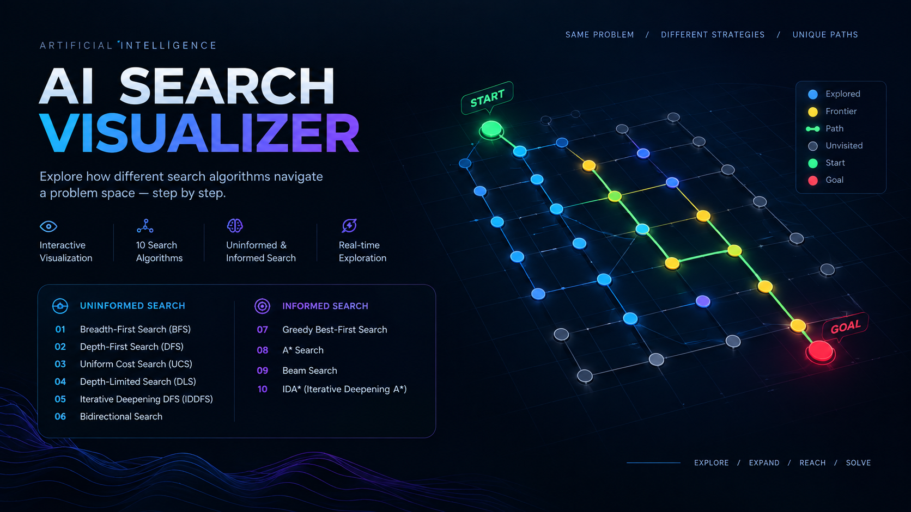

# AI Search Visualizer

### Interactive visualization of classical AI search algorithms

Explore how different search strategies navigate a problem space, expand nodes, manage the frontier, and discover a path toward a goal.

The **AI Search Visualizer** is an interactive single-page web application that makes classical Artificial Intelligence search algorithms easier to understand through step-by-step visual execution.

It includes both **uninformed** and **informed (heuristic)** search strategies, allowing you to observe how different algorithms approach the same problem in different ways.

---

## 🚀 Live Demo

**[▶ Open AI Search Visualizer](YOUR_GITHUB_PAGES_LINK)**

**[✦ Open Claude Artifact](YOUR_CLAUDE_ARTIFACT_LINK)**

> The live demo is hosted as a static HTML application and requires no installation.

---

## Preview

<p align="center">
  
</p>

<p align="center">
  <b>Same problem. Different strategies. Different exploration paths.</b>
</p>

---

## Overview

Search is one of the fundamental concepts in Artificial Intelligence.

Given an initial state and a goal, a search algorithm determines how to explore the available states until it finds a solution.

This project turns that process into an interactive visualization.

Instead of only studying algorithms through pseudocode or mathematical definitions, you can watch them:

* Explore nodes
* Manage the frontier
* Expand states
* Backtrack when necessary
* Calculate path costs
* Apply heuristic estimates
* Discover the goal
* Reconstruct the final solution path

The goal is to make the **behavior of search algorithms visible and easier to understand**.

---

# 🔎 Search Algorithms

The visualizer currently includes **10 classical AI search algorithms**, divided into two major categories.

---

## 01 — Uninformed Search

> Search strategies that have no additional knowledge about where the goal is.

### Breadth-First Search — BFS

Explores nodes level by level.

BFS prioritizes the shallowest unexplored nodes before moving deeper into the search space.

**Key idea:**

> Search wide before going deep.

**Useful when:**

* Every action has the same cost
* The shallowest solution is preferred

---

### Depth-First Search — DFS

Explores one branch as deeply as possible before backtracking.

**Key idea:**

> Go deep before exploring alternatives.

DFS can reach deep solutions quickly, but it does not guarantee the shortest path.

---

### Uniform Cost Search — UCS

Expands the node with the lowest accumulated path cost.

Unlike BFS, UCS considers the actual cost required to reach each state.

**Key idea:**

> Always expand the cheapest path discovered so far.

---

### Depth-Limited Search — DLS

A variation of DFS that prevents exploration beyond a specified depth.

**Key idea:**

> DFS with a maximum depth boundary.

This prevents the algorithm from searching indefinitely down a deep branch.

---

### Iterative Deepening DFS — IDDFS

Repeatedly performs depth-limited searches while increasing the depth limit.

```text
Depth 0
   ↓
Depth 1
   ↓
Depth 2
   ↓
Depth 3
   ↓
...
```

IDDFS combines the low memory characteristics of DFS with the systematic depth exploration of BFS.

---

### Bidirectional Search

Searches simultaneously from the start and goal states.

```text
START  →  →  →  ←  ←  ←  GOAL
```

The two searches continue until their explored regions meet.

**Key idea:**

> Search from both ends instead of only one.

---

# 02 — Informed Search

> Search strategies that use additional knowledge about how close a state may be to the goal.

These algorithms use a **heuristic function** to guide exploration.

```text
h(n) = estimated cost from node n to the goal
```

---

### Greedy Best-First Search

Chooses the node that appears closest to the goal according to the heuristic.

```text
Priority = h(n)
```

**Key idea:**

> Follow the node that looks closest to the goal.

It can be fast, but it does not always produce the optimal solution.

---

### A* Search

Combines the actual cost already traveled with an estimated remaining cost.

```text
f(n) = g(n) + h(n)
```

Where:

```text
g(n) = cost from START to n
h(n) = estimated cost from n to GOAL
f(n) = estimated total cost
```

A* is one of the most widely used informed search algorithms.

---

### Beam Search

Keeps only a limited number of the most promising nodes at each level.

The limit is controlled by the **beam width**.

```text
Beam Width = 3

        START
       /  |  \
      A   B   C
     /|\  |   |\
    ...  ...  ...
```

This reduces memory usage but may discard a path that would eventually lead to the optimal solution.

---

### IDA* — Iterative Deepening A*

IDA* combines:

* Iterative Deepening
* A* search
* Heuristic evaluation

Instead of maintaining a large priority queue, IDA* repeatedly increases an `f(n)` threshold.

```text
Threshold
   ↓
Search
   ↓
Increase threshold
   ↓
Search again
   ↓
Goal
```

This allows heuristic-guided searching while keeping memory requirements relatively low.

---

# 📊 Algorithm Comparison

| Algorithm         | Type       | Heuristic | Main Strategy                          |
| ----------------- | ---------- | --------: | -------------------------------------- |
| BFS               | Uninformed |         ❌ | Explore level by level                 |
| DFS               | Uninformed |         ❌ | Explore deeply                         |
| UCS               | Uninformed |         ❌ | Lowest path cost                       |
| DLS               | Uninformed |         ❌ | DFS with depth limit                   |
| IDDFS             | Uninformed |         ❌ | Repeated depth-limited DFS             |
| Bidirectional     | Uninformed |         ❌ | Search from both ends                  |
| Greedy Best-First | Informed   |         ✅ | Lowest heuristic                       |
| A*                | Informed   |         ✅ | Path cost + heuristic                  |
| Beam Search       | Informed   |         ✅ | Keep best limited candidates           |
| IDA*              | Informed   |         ✅ | Iterative deepening with A* evaluation |

---

# 🧠 What You Can Visualize

The visualizer makes the internal search process observable.

Depending on the selected algorithm, you can observe:

* 🟢 Start state
* 🔴 Goal state
* 🔵 Explored nodes
* 🟡 Frontier / candidate nodes
* 🟢 Final solution path
* 📊 Search statistics
* 🧮 Path cost
* 🎯 Heuristic values
* 🔢 Node expansion order
* ⏱️ Search progression

This makes it possible to compare not only **which solution was found**, but also **how the algorithm reached it**.

---

# 💡 Why This Project?

Search algorithms are often introduced using:

* Mathematical definitions
* Pseudocode
* Search trees
* Static diagrams

These explain the theory, but they don't always show what is happening during execution.

This project focuses on making the process visible.

> **Don't just learn how the algorithm works. Watch it work.**

By running different algorithms on the same problem, you can observe differences in:

* Exploration patterns
* Node expansion
* Solution paths
* Search efficiency
* Path cost
* Heuristic guidance
* Memory behavior

---

# 🔬 Core AI Concepts Demonstrated

### Search Space

Represents the possible states and transitions that an algorithm can explore.

### State Expansion

Determines which neighboring states should be considered next.

### Frontier

Contains discovered states that have not yet been explored.

### Path Cost

Tracks the cost required to reach a particular state.

### Heuristic

Provides an estimate of the remaining cost or distance to the goal.

### Solution Reconstruction

Uses parent relationships to reconstruct the final path after reaching the goal.

---

# ⚙️ How It Works

```text
START
  │
  ▼
Select Search Algorithm
  │
  ▼
Configure Search Environment
  │
  ▼
Initialize Frontier
  │
  ▼
Expand Nodes
  │
  ├───────────────┐
  │               │
  ▼               ▼
Explore         Evaluate
States          Candidates
  │               │
  └───────┬───────┘
          ▼
       Goal Found?
        /      \
      No        Yes
      │          │
      ▼          ▼
 Continue     Reconstruct
 Searching       Path
                   │
                   ▼
                 DONE
```

---

# 📈 Comparing Search Behavior

One of the main purposes of the visualizer is to make algorithmic differences easy to observe.

Given the same problem, different algorithms may explore completely different areas before reaching the goal.

For example:

```text
             ┌── A
             │
START ───────┼── B ───── GOAL
             │
             └── C
```

BFS may systematically explore each level.

DFS may follow one branch much deeper.

UCS may choose a more expensive-looking route differently depending on edge costs.

A* can use heuristic information to focus exploration toward the goal.

This makes the differences between algorithms much easier to understand than simply memorizing their definitions.

---

# ✨ Features

* [x] Interactive search visualization
* [x] 10 classical AI search algorithms
* [x] Uninformed search algorithms
* [x] Informed search algorithms
* [x] Step-by-step execution
* [x] Search path visualization
* [x] Frontier visualization
* [x] Goal detection
* [x] Algorithm comparison
* [x] Search statistics
* [x] Heuristic-based algorithms
* [x] Configurable search environment
* [x] Runs directly in the browser
* [x] No installation required

---

# 🛠️ Technology

This project intentionally uses a lightweight architecture.

```text
Single HTML File
       │
       ├── HTML
       ├── CSS
       └── JavaScript
```

There is no backend, database, framework, or build process required.

The entire visualizer runs directly in the browser.

---

# 🚀 Run Locally

Because the project is a standalone HTML application, running it locally is simple.

### Option 1 — Open directly

Download the repository and open the HTML file in your browser.

### Option 2 — Local server

Clone the repository:

```bash
git clone https://github.com/Ali0369/AI-Search-Visualizer.git
```

Open the project folder and launch the HTML file.

No package installation is required.

---

# 🌐 Deployment

The project can be deployed using any static hosting service.

Recommended:

**GitHub Pages**

GitHub Pages can publish static HTML, CSS, and JavaScript directly from a repository.

**Cloudflare Pages**

Cloudflare Pages also supports plain static HTML websites and provides a free `*.pages.dev` deployment URL.

---

# 🗂️ Project Structure

```text
AI-Search-Visualizer/
│
├── index.html
├── AI-Visualizer-ProjectCover.png
└── README.md
```

The visualizer is intentionally kept as a **single HTML file**, making it easy to download, run, study, and share.

---

# 🎓 Educational Purpose

This project was created as an educational visualization tool for understanding classical Artificial Intelligence search algorithms.

It is intended to complement theoretical learning by providing an interactive representation of how different search strategies operate.

---

# 👨‍💻 Author

**Muhammad Ali**

AI/ML Engineer · Software Developer · Automation Builder

Building intelligent software systems across **AI/ML, software engineering, and automation**.

---

## License

This project is available under the MIT License.
